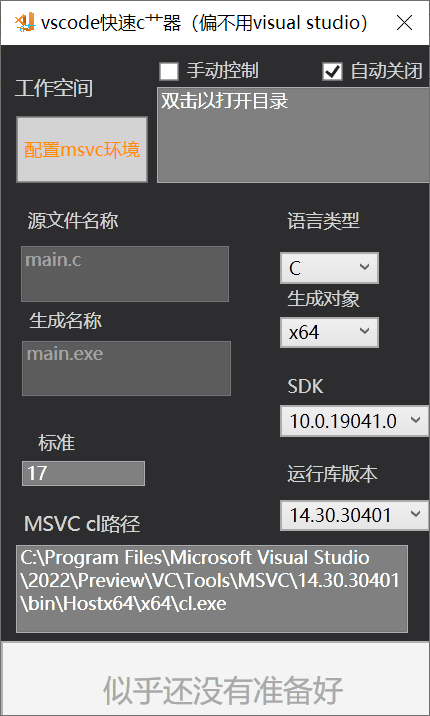

# vs-code-msvc-tool
quick launch of a single-file c/cpp project in vs code with msvc

高考完了，最近拿到了新电脑，决定写个啥开开光（bushi），于是就有了这个——

当你同时安装了visual studio和visual studio code时，自然会想到利用msvc环境在vs code里码点稀松的小代码。

毕竟动不动就要面对**庞大的vs**，挺别扭的（吗？）。

> 现在，这个粗糙的小玩意可以解决您的烦恼（），好耶！

参考巨硬的[良心教程](https://code.visualstudio.com/docs/cpp/config-msvc)和[csdn的文章](https://blog.csdn.net/qq_38981614/article/details/99629597)用c#摸了一个自动化小玩意，就长这样：

（话说vs 2022 preview的热重载确实好用）

>使用教程
>第一次启动时请点击**配置msvc环境**以开始。默认根据vswhere.exe搜索的最新版本为选中版本。接下来填空就行辣！

>生成的工作空间下会多出来一个批处理文件，用以快速启动。

>若想启动已有的内容，可以直接选定工作空间时选择已有空间，程序会询问是否直接启动。

>双击**工作空间**四个大字，自动打开上一次启动过的工作空间文件夹。

>配置文件写在"我的文档"里，不要乱改。
